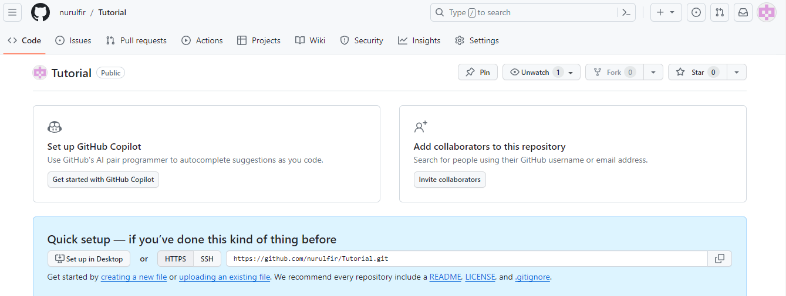
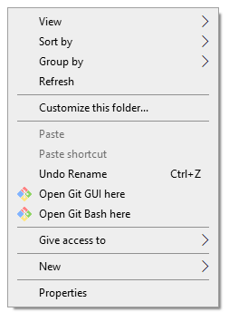
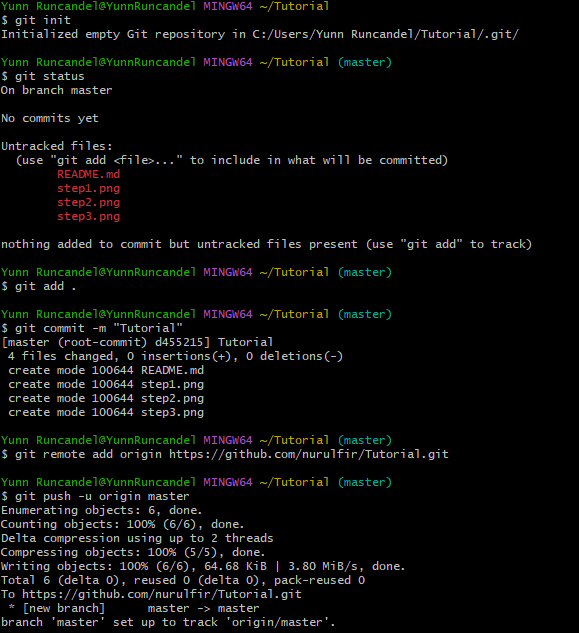
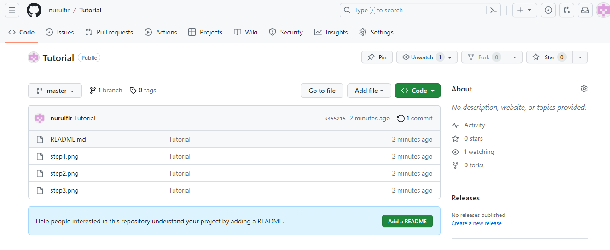

# Tutorial melakukan tugas bahasa pemrograman

## Buat folder di local disk
* Masuk ke local disk, pilih user, pilih [nama perangkat]

### Contohnya

* Buat file dengan nama sesuai keinginan kalian
* NOTE: Jangan lupa untuk membuat codingan terlebih dahulu di file ini, agar tidak perlu push/upload lagi

## Buat Repository
* Selanjutnya kalian bisa membuat repository di github dengan nama sesuai keinginan kalian

### Contohnya

## Cara push melalui gitbash
* Kalian masuk ke folder yang kalian buat sebelumnya lalu klik kanan pada folder tersebut dan pilih open gitbash here

### Masukkan code dengan tahapan sebagai berikut :
* git init [Fungsinya adalah untuk menginisialisasi folder]
* git status [Fungsinya adalah untuk mengecek isi file tersebut]
* git add . [Fungsinya adalah untuk menambahkan file tersebut]
* git commit -m "bisa diisi apa saja" [Fungsinya aalah untuk melakukan commit atau konfirmasi]
* git remote add origin URL [Fungsinya adalah untuk menambahkan remote ke repository yang sebelumnya kita buat]
* git push -u origin master [Fungsinya adalah untuk melakukan push ke repository yang sebelumnya kita buat]

### Contohnya

## Cek ke github apakah sudah ter push atau belum, coba klik refresh jika belum, maka hasilnya akan seperti ini

## Dan kalian pun telah berhasil melakukan nya, mudah bukan ?
## Ikutin update dariku untuk tutorial lainnya Terima kasih